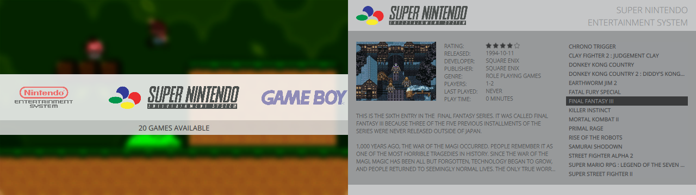

<!--  -->
# Homage theme for Pegasus

This is theme for [Pegasus](http://pegasus-frontend.org) frontend.

## Installation

[Download](https://github.com/asdfgasfhsn/pegasus-theme-es2-simple/archive/master.zip) and extract to your [theme directory](http://pegasus-frontend.org/docs/user-guide/installing-themes). You can then select the theme in the settings menu of Pegasus.

## License

